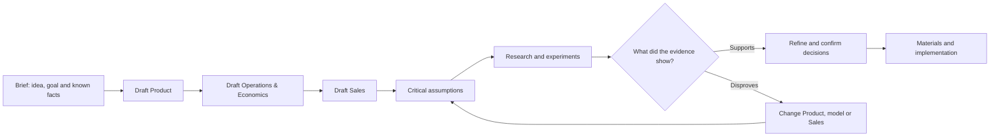

---
confirmation:
  confirmed: true
  by: operator
  at: 2026-09-17
  source: "Operator confirmed the revised Project model in chat: «Хорошо, это
    подтверждаем»."
  content_sha256: b84c426171d25131fd5395c37a6505370515e8c0a3648ff8fc0962b6d2f04633
review:
  dependencies:
    model.framework-service: 24505045708eaee8184c7d988841e54b6408be46051b785d18989c6329a14a80
    product.ai-chat.product: 91f9368e4f450d3a1b82a775df616972fe8aab756c6890331292f5327fdc4d84
---

# Project model

The first setup produces an editable Project model: one page with the current information from Request, Strategy, Brand, Design and Products, including unresolved questions. AI Chat uses this page when answering later questions or editing supplied materials, so the user does not have to explain the project again in every conversation.

The page displays information from the five sections together without storing another copy. Each fact is still edited in its main section. For example, a product price is stored in the Product section and only displayed in the Project model.

## Page structure

### Request

- what the project is and why the user is working on it now;
- its current state, products and supplied materials;
- the requested result, boundaries, decision authority and constraints;
- unanswered questions that cannot be resolved from the supplied information.

### Strategy

- the intended final state of the complete project;
- priority audiences and the role of each product;
- positioning and the customer path across products and channels;
- continued use and measures of success.

Strategy describes how the project should work when it fulfils the Request. It records the intended result, not a roadmap or the history of how each decision was made.

### Brand

- what the audience should understand and remember;
- the promise, supported claims and available evidence;
- voice, important objections and calls to action.

### Design

- visual identity and interface principles;
- existing assets and references that should be preserved;
- photography, illustration and essential production rules;
- accessibility and technical constraints that affect the result.

### Products

Each product is shown as one business model:

1. **Customer and value:** customer segments and roles, circumstances, desired progress, problems, alternatives, the offer and its value.
2. **Access and relationship:** discovery, evaluation, purchase, delivery, use, support and continued use.
3. **Money and delivery:** payer, revenue, resources, activities, partners, costs and financing where relevant.
4. **Sales and learning:** the complete customer process, measures, current observations and unanswered research questions.

When several products use one model, that model has a stable identifier and is stored once. The Project model shows which products use it without copying the shared facts.

## Product development loop

This diagram is the editable source for the order of work. It separates draft decisions from evidence and shows what happens when research supports or disproves a critical assumption.

The Brief provides the idea, intended result and known facts. Product, Operations & Economics and Sales turn them into a complete draft that can be inspected for critical assumptions. Research and experiments then provide the evidence needed to keep or change those decisions.

Materials and implementation include Product Content, Website, Marketing Creative, Presentation and the work required to deliver the product. Observations and measurements from implemented work belong to Analytics. If they expose another critical assumption, the loop begins again from that assumption; the team updates the owning decision before revising dependent materials.

## Information states

Every statement has one of four review states:

- **accepted:** the user has reviewed the current wording;
- **proposal:** AI Chat drafted the statement and the user has not reviewed it yet;
- **unknown:** neither the supplied material nor the user provides the required information;
- **conflict:** two supplied statements give incompatible answers to the same question.

These states help the user review the page. They do not create a separate hypothesis register or another business document.

## Use after setup

For each request, AI Chat uses the relevant parts of the Project model. It can answer a question, critique an idea, edit an uploaded file or prepare new material. Its answer follows accepted project decisions. If missing information would change the answer, AI Chat names what is missing instead of filling the gap itself.

When the user accepts a change, AI Chat updates the main section where that information is stored and marks affected materials for review. A landing page, presentation or advertisement may reuse approved facts, but it does not become the source of the offer, price or product conditions.

The Project model is enough for ordinary questions and the first product materials. When a topic needs deeper research, a complete process or its own working document, the user can open the relevant detailed section of the project.
