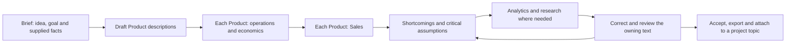

---
confirmation:
  confirmed: true
  by: operator
  at: 2026-09-17
  source: "Operator confirmed the revised Project model in chat: «Хорошо, это
    подтверждаем»."
  content_sha256: b84c426171d25131fd5395c37a6505370515e8c0a3648ff8fc0962b6d2f04633
review:
  dependencies:
    product.ai-chat.product: 5212a0163b9d453689340ff925ed6d6d94d729e0c890e8e0d75209b6e6eb50bb
---

# Project model

Brief.md, Strategy.md, Brand.md, Design.md and Products.md each have a working thread with their own conversation, draft and edits. Each product has its own sections. The user answers the agent's questions in the owning file's thread and reviews the wording before saving it. The general project workspace holds separate discussion topics with selected saved documents attached as their knowledge base. The documents can be freely exported.

The overview displays the owning texts without storing another editable copy. A product's offer and economics are edited in that Product; the project overview displays them.

## Project stages

### Brief

Describe the project, current situation, products, supplied material, intended result, boundaries, constraints and decision authority. Unknown facts remain open.

### Strategy

Describe priority audiences, product roles, positioning, customer paths, channels and measures of success. State how the project should work, rather than a history of decisions.

### Brand

Describe meaning, promise, supported claims, evidence, voice, objections and calls to action.

### Design

Write the intended visual direction, existing assets, interface principles and constraints. This first-release text does not generate a brand identity or build a landing page.

### Products

Keep separate descriptions for every product in scope. Each product opens its own sections:

| Product section            | Contents                                                                                                                            |
| -------------------------- | ----------------------------------------------------------------------------------------------------------------------------------- |
| **Product**                | Customer, problem, offer, value, alternatives and conditions.                                                                       |
| **Operations & Economics** | Delivery, revenue, resources, activities, partners, costs and financing owned by that Product.                                      |
| **Sales**                  | Discovery, evaluation, purchase, delivery, use, support and continued use.                                                          |
| **Promotion**              | A written description of how this product will be presented publicly, with Website, Creative and Presentation texts where relevant. |
| **Analytics & Research**   | Measures, observations, questions and evidence required for its assumptions, with research where needed.                            |

Shared resources use the same resource identifier in the Products that consume them, with each Product stating its allocated share. The economics view introduces no intermediate shared model.

## Product development loop

```mermaid
flowchart LR
    A[Brief: idea, goal and supplied facts] --> B[Draft Product descriptions]
    B --> C[Each Product: operations and economics]
    C --> D[Each Product: Sales]
    D --> E[Shortcomings and critical assumptions]
    E --> F[Analytics and research where needed]
    F --> G[Correct and review the owning text]
    G --> H[Accept, export and attach to a project topic]
    G --> E
```

The AI agent identifies shortcomings for the user to correct. Research records attributable evidence where it exists and questions where it does not. Acceptance records review of the text, not validation of the business.

## Information states

- **accepted:** the user reviewed this wording;
- **proposal:** a draft awaiting the user's review;
- **unknown:** the supplied material and user have not established the required fact;
- **conflict:** supplied statements give incompatible answers.

These labels apply to the owning description. A proposed change returns to that text for review before replacing accepted wording.

## Continued work in chat

The user creates a topic in the general project workspace and chooses which saved, reviewed documents to attach. Each topic keeps its own conversation and uses those files to evaluate an idea, compare options or draft written content. Document changes return to the owning file's thread for review.

Topics can start with one reviewed file while other sections have open questions. A document's last reviewed version remains available as topic context while its new draft is being revised, and changes only after review and saving. The user may freely export and use the documents outside AI Chat. A missing fact remains open rather than being invented to complete an answer.

Landing-page generation and paid server deployment are future capabilities outside this first release. The later page is intended to collect initial enquiries and test a hypothesis; those outcomes are not guaranteed.
