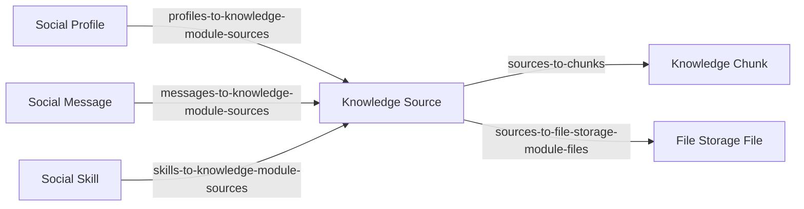

# Единая модель материалов Knowledge

Source становится единственной основной моделью материала Knowledge. Она хранит редактируемый текст, хеш текущего текста, хеш проиндексированного текста и время успешной индексации. Актуальность индекса определяется по `contentHash` и `indexedContentHash`. Chunk хранит производный фрагмент и embedding. Document, Edit Suggestion и `profiles-to-knowledge-module-documents` удаляются вместе с их API, SDK и интерфейсами. Профиль получает новую relation `profiles-to-knowledge-module-sources`.

Knowledge не используется ни в одной развёрнутой версии проекта. Изменение выполняется напрямую: существующие функции и интерфейсы переключаются на Source. Перенос и сверка данных, backfill, архивирование предложений, совместимость старых API и проверки обновления развёрнутых версий не входят в работу.

Проектирование охватывает схему, relations, загрузку и мультимодальную обработку нескольких файлов в один Source, прямое изменение материала инструментом после согласования в чате, RAG, профильный доступ, SDK и интерфейсы. План одобрен для реализации и проверки через интерфейс чата.

## Целевое поведение

1. Source хранит единственный актуальный текст материала: сведения из файлов вместе с пользовательскими пояснениями, новостями и контекстом. Один материал может объединять несколько файлов разных форматов; Chunk хранит производный индекс общего текста.
2. Обсуждение правки проходит в чате. Явное поручение пользователя применить конкретные изменения разрешает инструменту сразу обновить Source. Дополнительной стадии approve и модели предложений нет.
3. Сохранение текста обновляет `contentHash`. Если `indexedContentHash` отсутствует или отличается от `contentHash`, автоматически запускается адресная индексация Source. Reindex остаётся для повторной попытки, принудительного перестроения и смены embedding-модели.
4. Просьбу «верни назад» модель может выполнить обычной обратной правкой по контексту диалога. Встроенный механизм отката не разрабатывается.
5. Операционные связи находятся в relations.
6. При загрузке файлов система определяет формат каждого файла и выбирает обработку: PDF анализируется постранично вместе с изображениями; изображения описываются; видео разбирается по кадрам и аудиодорожке. Текстовые результаты всех файлов одного материала объединяются в `Source.content`. Все загруженные файлы прикрепляются к этому Source через `sources-to-file-storage-module-files`.
7. Добавление, удаление или замена связи Source → File автоматически запускает повторный анализ всех файлов, которые сейчас прикреплены к этому Source. Модель обновляет сведения из файлов и общий вывод с учётом сохранённого пользовательского контекста. Удаляются сведения, основанные только на отсоединённом файле; добавленные человеком пояснения сохраняются в `content`.

## Основания в текущем коде

- Индексатор читает `Document.description`, создаёт Source и его Chunks: [indexer/index.ts](/Users/rogwild/code/singlepagestartup/sps-lite/libs/modules/knowledge/backend/app/api/src/lib/indexer/index.ts:89).
- Связь Source с Document хранится в `metadata.documentId` и синтетическом `originalPath`: [repository.ts](/Users/rogwild/code/singlepagestartup/sps-lite/libs/modules/knowledge/backend/app/api/src/lib/repository.ts:288).
- Повторный файловый импорт обновляет тело существующего Document без проверки ручных изменений: [repository.ts](/Users/rogwild/code/singlepagestartup/sps-lite/libs/modules/knowledge/backend/app/api/src/lib/repository.ts:148).
- `clearDerivedData()` удаляет Sources и их файловые связи. После объединения моделей такое поведение уничтожало бы первичные материалы: [repository.ts](/Users/rogwild/code/singlepagestartup/sps-lite/libs/modules/knowledge/backend/app/api/src/lib/repository.ts:352).
- Профиль связан с Document через Social relation: [schema.ts](/Users/rogwild/code/singlepagestartup/sps-lite/libs/modules/social/relations/profiles-to-knowledge-module-documents/backend/repository/database/src/lib/schema.ts:16).
- Edit Suggestion хранит предложенный текст, а approve применяет его к Document и затем индексирует. Это отдельный сценарий согласования, а не механизм определения устаревшего индекса. В проверенных `/learn` и AI-reply handlers вызовов создания предложений нет; CRUD и approve/reject API доступны: [service.ts](/Users/rogwild/code/singlepagestartup/sps-lite/libs/modules/knowledge/backend/app/api/src/lib/service.ts:325).
- Удаление Document удаляет файлы, проверяя оставшиеся связи только в Knowledge. Использование файла другими модулями этим условием не учитывается: [repository.ts](/Users/rogwild/code/singlepagestartup/sps-lite/libs/modules/knowledge/backend/app/api/src/lib/repository.ts:384).
- Обновление профильного списка зависит от topics `knowledge.documents` и `social.profiles-to-knowledge-module-documents`: [topics/singlepage.ts](/Users/rogwild/code/singlepagestartup/sps-lite/libs/shared/utils/src/lib/topics/singlepage.ts:47).
- Текущий `/learn` принимает TXT/MD/Markdown и вызывает `learnContent` отдельно для каждого текстового элемента. Группировка файлов в один материал и анализ PDF/изображений/видео здесь ещё не реализованы: [learnFromMessage](/Users/rogwild/code/singlepagestartup/sps-lite/libs/modules/rbac/models/subject/backend/app/api/src/lib/controller/singlepage/social-module/profile/find-by-id/chat/find-by-id/message/react-by-openrouter.ts:2915), [isSupportedLearnAttachment](/Users/rogwild/code/singlepagestartup/sps-lite/libs/modules/rbac/models/subject/backend/app/api/src/lib/controller/singlepage/social-module/profile/find-by-id/chat/find-by-id/message/react-by-openrouter.ts:3278).
- Файловый индексатор читает подготовленные TXT/Markdown; он не извлекает содержание из исходного PDF или видео: [content-discovery/index.ts](/Users/rogwild/code/singlepagestartup/sps-lite/libs/modules/knowledge/backend/app/api/src/lib/indexer/content-discovery/index.ts:6).
- Relation Source → Files уже допускает несколько файлов, но helper репозитория выбирает только первую связь. Его нужно заменить операциями над полным набором: [schema.ts](/Users/rogwild/code/singlepagestartup/sps-lite/libs/modules/knowledge/relations/sources-to-file-storage-module-files/backend/repository/database/src/lib/schema.ts:10), [findSourceFileRelation](/Users/rogwild/code/singlepagestartup/sps-lite/libs/modules/knowledge/backend/app/api/src/lib/repository.ts:969).
- В обработке аудиосообщений уже есть вызов транскрипции и запуск FFmpeg. Этот код может служить основой для повторного использования интеграций; выравнивание кадров видео и транскрипции нужно реализовать отдельно: [audio-transcription.ts](/Users/rogwild/code/singlepagestartup/sps-lite/libs/modules/rbac/models/subject/backend/app/api/src/lib/controller/singlepage/social-module/profile/find-by-id/chat/find-by-id/message/audio-transcription.ts:170).
- Обычный CRUD автоматически обновляет `updatedAt`. Сравнение хешей позволяет сохранять результаты индексации этим же путём, без исключения для даты обновления: [prepareWritableData](/Users/rogwild/code/singlepagestartup/sps-lite/libs/shared/backend/api/src/lib/repository/database/index.ts:379).

## Модели и поля

Source обозначает один материал по смыслу: например, бухгалтерский отчёт за год, собранный из PDF, таблиц в изображениях и видео с пояснениями. Число файлов не определяет число Sources. Материал также может содержать только текст сообщения или введённый вручную Markdown и существовать без файлов и без индекса.

| Поле Source                                 | Назначение                                                                                                                            |
| ------------------------------------------- | ------------------------------------------------------------------------------------------------------------------------------------- |
| `id`, `slug`, `title`, стандартные поля SPS | Идентификатор, стабильный ключ материала, заголовок и отображение                                                                     |
| `content`                                   | Полное редактируемое знание: пользовательский контекст, извлечённый текст, описания изображений и событий, транскрипция и общий вывод |
| `description`                               | Необязательное краткое резюме итогового `content`; самостоятельным источником знания не является                                      |
| `contentHash`                               | Серверный хеш текущего нормализованного `content`                                                                                     |
| `indexedContentHash`                        | Хеш текста последней успешно завершённой индексации; до первой индексации — null                                                      |
| `lastIndexedAt`                             | Время последней успешно завершённой индексации; до первой индексации — null                                                           |

В Source остаются стандартные поля SPS, `title`, `content`, `description`, `contentHash`, `indexedContentHash` и `lastIndexedAt`. Поля `originalPath`, `tags`, `origin`, `type`, `indexedEmbeddingSignature`, `importedContentHash`, `status`, `indexError` и `metadata` отсутствуют в итоговой модели. Файлы доступны через relation и File Storage; происхождение из сообщения или skill — через соответствующие relations. Страницы и временные отметки входят в текст `content`; параметры обработки задаются конфигурацией или текущим вызовом.

`content` остаётся обязательным полем: в нём хранится согласованное текстовое представление всех материалов. При создании Source или сохранении `content` сервис вычисляет SHA-256 по нормализованному тексту. Заголовок, краткое описание, даты и поля индексации в этот хеш не входят. Клиент не задаёт `contentHash` самостоятельно; пути редактора, инструмента и обработки файлов используют одно вычисление в сервисном слое. Отдельный хеш всей записи и контракт `expectedRecordHash` не добавляются. Редактор и инструмент обновляют материал обычным SDK с проверкой RBAC.

Актуальность определяется одним условием:

```ts
const needsIndexing = !source.indexedContentHash || source.contentHash !== source.indexedContentHash;
```

Обычный CRUD обновляет `updatedAt` по правилам фреймворка. Изменение только заголовка, краткого описания или служебных полей не меняет `contentHash` и само по себе не требует переиндексации. Повторное сохранение того же текста при актуальном индексе не вызывает embeddings.

После успешной публикации Chunks сервис сохраняет `indexedContentHash` обработанного текста и `lastIndexedAt` обычным обновлением Source. Это обновление может изменить `updatedAt`; актуальность от него не зависит. `lastIndexedAt` используется для отображения времени индексации. Отдельного метода репозитория, сохраняющего прежний `updatedAt`, и исключения в общем CRUD нет. Запись результата индексации не меняет `contentHash` и не запускает её повторно, когда хеши совпадают.

Ошибка не меняет `indexedContentHash` и `lastIndexedAt`. При непроиндексированном или изменённом тексте несовпадение хешей сохраняет необходимость индексации. Ошибка возвращается вызывающему коду и записывается в существующий журнал выполнения/лог, без поля в Source. Текущий прогресс отображается состоянием операции в интерфейсе; отдельного постоянного статуса материала нет.

Изменение файловых relations автоматически запускает полный цикл: сохранение пользовательского контекста из текущего `content` → анализ всех текущих прикреплённых Files → обновление сведений из файлов и общего вывода → вычисление `contentHash` → индексация. Модель использует пользовательские пояснения для интерпретации материалов. Автоматические описания отсоединённых файлов и выводы, основанные только на них, не переносятся в результат.

После успешного изменения набора вложений сервис сохраняет пользовательскую часть `content`, удаляет прежние автоматически сформированные разделы и сбрасывает прежнее краткое резюме. `indexedContentHash` и `lastIndexedAt` сбрасываются в null, старые Chunks удаляются. Пользовательский текст остаётся в самой записи Source даже при ошибке анализа. Индексация запускается после завершения сборки, а удалённые описания файлов при ошибке не возвращаются. Если удалена последняя файловая связь, сохранённый пользовательский контекст становится содержанием Source и индексируется. Если пользовательского текста тоже нет, Source остаётся пустым, embeddings не вызываются.

## Пользовательский контекст внутри content

Происхождение текста различается внутри одного Markdown-поля `content` с читаемыми разделами:

- **Контекст пользователя:** пояснения, новости, причины появления данных, уточнения и дополнения человека.
- **Сведения из материалов:** автоматически извлечённые сведения текущих Files с обозначением страниц и времени.
- **Общее описание:** вывод модели по актуальным материалам с учётом пользовательского контекста.

Это структура одного `content`, без дополнительных полей, моделей версий или журнала правок. Разделы сохраняются редактором и инструментами. При создании текстового Source без файлов весь переданный человеком текст относится к пользовательскому контексту; при последующем прикреплении Files этот текст сохраняется. Пояснения из сообщения при загрузке и более поздние дополнения пользователя также попадают в этот раздел.

При автоматической пересборке сервис переносит пользовательский раздел без изменений и соединяет его с обновлёнными разделами модели. Модель получает этот контекст для анализа и общего вывода, но не должна сокращать или удалять исходные пояснения. Сохранение пользовательского раздела проверяется перед записью; одного указания в prompt недостаточно. Изменение пользовательского текста выполняется обычным редактированием или явным поручением в чате.

Редактор и инструменты фиксируют добавленные человеком пояснения и поправки в пользовательском разделе, в том числе при редактировании общего материала. При сохранении они используют текущий `content` и подготовленную правку, чтобы сохранить происхождение изменяемого текста. Модель не определяет авторство по тому, совпадает ли фраза с файлом. Пользовательское пояснение может ссылаться на отсоединённый файл и всё равно сохраняется как утверждение пользователя; прежний автоматический вывод по этому файлу пересматривается.

Например, человек добавил к отчётам пояснение «выручка изменилась после продажи подразделения». После удаления приложения его таблицы и автоматические выводы по ним исчезают, а пояснение человека остаётся в пользовательском разделе. Новый общий вывод формируется по оставшимся файлам и этому пояснению. Противоречие между пользовательским утверждением и материалами обозначается явно; модель не исправляет слова пользователя автоматически.

`description` пока сохраняется как необязательное краткое резюме полного `content`. При сборке модель может вернуть его в том же вызове вместе с обновлёнными разделами. Резюме учитывает и материалы, и пользовательский контекст. Отдельный сценарий генерации или обязательное применение этого поля в интерфейсе не добавляются; поиск и индексация используют полный `content`.

После изменения провайдера или модели embeddings либо chunker запускается явный Reindex затронутых Sources. Хеш текста сам по себе не обнаруживает изменение конфигурации; отдельная signature в Source не хранится.

Операции, которые раньше читали или изменяли полный текст в `Document.description`, работают с `Source.content`. Краткое описание, для которого использовался `Document.summary`, редактируется через `Source.description`.

Chunk сохраняет текст, embedding, позицию, оценку количества токенов, хеш и метаданные парсинга. Поля `documentId` и `documentSlug` в его metadata больше не нужны. Текст Chunk является фрагментом индекса и не редактируется отдельно от Source.

Сохранённая правка пользователя или разрешённое изменение через API сразу меняет Source. Обнаружение отличия текущего текста от проиндексированного не требует промежуточной записи Edit Suggestion. Согласование правки выполняется в обычном диалоге и не порождает отдельную запись ожидания approval.

## Relations и владельцы



| Relation                               | Владелец и правило                                                                                                                                               |
| -------------------------------------- | ---------------------------------------------------------------------------------------------------------------------------------------------------------------- |
| `sources-to-chunks`                    | Knowledge; существует, сохраняется. В рабочем индексе Chunk принадлежит одному Source                                                                            |
| `sources-to-file-storage-module-files` | Knowledge; один Source связан с любым числом Files, включая ноль. `orderIndex` задаёт порядок файлов в общем текстовом представлении; пара Source–File уникальна |
| `profiles-to-knowledge-module-sources` | Social; заменяет профильную связь с Document и определяет область доступного Knowledge                                                                           |
| `messages-to-knowledge-module-sources` | Social; `kind=origin` — происхождение, `kind=citation` — цитирование                                                                                             |
| `skills-to-knowledge-module-sources`   | Social; указывает skill, при выполнении которого импортирован материал                                                                                           |

Связи имеют внешние ключи, индексы и ограничения уникальности для своих пар; для Message–Source ключ учитывает `kind`. Ограничение одного владельца Chunk задаётся на стороне relation. Удаление Source снимает связи; Chunks без владельца очищаются сервисом. Chunk одного Source не используется как общий изменяемый индекс нескольких материалов.

Общий сервисный обработчик Source → Files запускает пересборку после создания или удаления связи, замены File в связи либо переноса связи между Sources. При переносе пересобираются оба Source. Операции из API, SDK, админки и инструментов чата используют этот обработчик. Изменение порядка Files также учитывается при сборке. Для групповой загрузки сначала сохраняется весь набор relations, затем выполняется один анализ итогового набора на Source. Снятие файловых связей при удалении самого Source не запускает его повторную обработку.

История ответа сохраняет снимок процитированного текста, позицию фрагмента и дату редакции материала. Операционная ссылка ответа на материал находится в Message–Source relation; хранение старых embeddings для истории цитат не требуется. Открытие текущего Source по цитате проверяет доступ, а интерфейс различает снимок цитаты и текущую редакцию. При удалении Source операционные ссылки цитат снимаются, но сохранённые снимки текста в истории ответа остаются.

Knowledge работает со своими моделями и relations. RBAC проверяет доступ и оркестрирует создание Social relations через существующие сервисы/SDK. Knowledge не читает таблицы Social для определения доступа.

`metadata.documentId`, `fileId`, идентификаторы профиля, сообщения и skill не используются как операционные связи. Происхождение из чата и thread выводится через Message и существующие Social relations. Metadata ответов содержит снимки цитат и сведения об исполнении; ссылки на сущности сохраняются в relations. API DTO может содержать `sourceId` и `chunkId`, полученные из этих связей.

## Обработка файлов, редактирование и индексация

**Группировка.** Пользователь создаёт один материал, например «Бухгалтерский отчёт за 2025 год», и загружает к нему несколько файлов. По умолчанию все файлы одного такого действия или одного `/learn` объединяются в один Source. Отдельные Sources создаются, если пользователь явно разделил материалы. Пояснения и сведения из сообщения сохраняются в пользовательском разделе `content`; инструкция об обработке задаёт задачу модели.

**Прикрепление.** Сначала создаётся или выбирается Source и к нему прикрепляются все исходные Files. Уже загруженные chat attachments используются по существующим File.id без загрузки копий. Сохранение нового набора связей автоматически запускает анализ всех прикреплённых файлов. Source и его профильная связь видны во время обработки; её прогресс относится к текущей операции в интерфейсе. Повторный `/learn` для того же материала находит Source через Message–Source relation и продолжает обработку без дубликатов материала или файловых связей. Один и тот же текст у разных профилей не служит основанием для объединения Sources.

**Определение формата.** Для каждого файла проверяется реальное содержимое и MIME-тип; одно расширение не считается достаточным. Модель получает файл или подготовленное представление и определяет, что в нём содержится. Обработчик формата выбирается по результатам проверки. Физический формат хранится в File Storage; отдельного типа материала в Source нет. Неподдерживаемый или повреждённый файл возвращает ошибку обработки и не пропускается молча.

| Формат         | Преобразование в текст                                                                                                                                                                                                                                                                                       |
| -------------- | ------------------------------------------------------------------------------------------------------------------------------------------------------------------------------------------------------------------------------------------------------------------------------------------------------------ |
| PDF            | Каждая страница визуально анализируется моделью; извлекается текст, при необходимости распознаётся скан. Изображения, диаграммы и графики получают текстовое описание; таблицы сохраняют значения и структуру. Результат упорядочен по страницам                                                             |
| Изображение    | Модель описывает содержание, распознаёт надписи и таблицы, объясняет изображённые схемы и графики                                                                                                                                                                                                            |
| Видео          | Извлекаются кадры с временными отметками; начальный шаг — один кадр в секунду, параметр обработки настраивается. Модель описывает кадры, надписи и происходящие события. Аудиодорожка транскрибируется с временными отметками. Описания кадров и речь объединяются по времени в текстовую последовательность |
| Аудио          | Выполняется транскрипция с временными отметками                                                                                                                                                                                                                                                              |
| Текстовый файл | Извлекается текст с сохранением структуры и значимых данных                                                                                                                                                                                                                                                  |

Модель не подменяет нечитаемые числа или фрагменты предположениями: в текстовом представлении отмечается, что именно не удалось прочитать. Отсутствие аудио у видео допускает обработку только кадров; наличие аудио требует обработки обеих составляющих.

**Объединение.** Результаты всех текущих прикреплённых файлов собираются в раздел сведений из материалов с обозначением файлов, страниц и временных интервалов. Модель формирует общий вывод с учётом пользовательского контекста. Сервис объединяет сохранённый пользовательский раздел и новые разделы модели в один `Source.content`. Например, PDF отчёта, сканы приложений, видео и пояснение человека о причинах изменения данных образуют единый материал. Сведения, основанные только на отсоединённых файлах, в автоматические разделы не включаются.

Структура текста позволяет отличать файлы, страницы и моменты видео. Операционная связь с File хранится в relation. `orderIndex` задаёт стабильный порядок разделов. Модель не добавляет сведения, которых нет в материалах; расхождения между ними сохраняются в описании.

**Завершение обработки.** Собранный `content` и необязательное резюме сохраняются одним обновлением Source после обработки всех текущих прикреплённых файлов, затем автоматически индексируются. Ошибка одного файла сохраняет Source, пользовательский контекст и все вложения, сообщает неуспешный этап и не выдаёт частичную обработку за готовый материал. Прежние автоматические разделы по отсоединённым файлам не восстанавливаются. Повторная попытка использует тот же Source и перечитывает актуальные relations и пользовательские пояснения. Перед сохранением результата сверяются текущий `contentHash`, пользовательский раздел и состав файловых relations с прочитанными в начале обработки; устаревший результат не записывается. Если пользователь добавил пояснение во время анализа, оно учитывается при новой сборке и не затирается. При новом изменении состава Files полный анализ выполняется для последнего набора. Промежуточные кадры и изображения страниц являются временными данными; отдельные модели Knowledge для них не создаются.

Обработка файлов и индексация текста — разные этапы. Reindex перестраивает Chunks из сохранённого `Source.content` и не запускает анализ PDF, видео или изображений заново. Изменение файловых relations автоматически запускает обработку всех текущих вложений, сборку текста и последующую индексацию. Повторный анализ того же набора Files можно также запустить явно. Сканирование путей в этот сценарий не входит.

**Редактирование.** Сохранение текста меняет Source и вычисляет `contentHash` по всему содержанию, включая пользовательский контекст. Редактор, разрешённый инструмент, завершённая обработка файлов и текстовый `/learn` запускают индексатор адресно для Source, когда текущий и проиндексированный хеши различаются. Индексация выполняется после фиксации записи; её ошибка не откатывает сохранённую правку. Команда Reindex повторяет обработку сохранённого текста и может принудительно перестроить актуальный индекс.

При недоступности embeddings материал и его профильная связь сохраняются. API и ответ инструмента отдельно сообщают результат обработки файлов, результат записи текста и результат индексации. Интерфейс показывает ход текущей операции и её ошибку. После обновления страницы актуальность материала определяется по двум хешам; отдельная сохранённая ошибка в Source недоступна. Повторная попытка использует тот же Source.

**Поиск.** Профиль получает разрешённые `sourceIds` из Social relation. SQL связывает Source и Chunk через `sources-to-chunks`. Материал участвует в поиске, если `indexedContentHash` существует и совпадает с `contentHash`. Пустой разрешённый список возвращает пустой результат; он никогда не включает глобальный поиск. Глобальный административный поиск имеет отдельный явный доступ.

После сохранения изменённого текста прежние Chunks временно исключены из RAG по условию хешей. Изменение файловых relations очищает прежние автоматически сформированные разделы и индекс, сохраняя пользовательский контекст. Пока новый анализ и индексация не завершены, Source виден со своими вложениями и пояснениями, но не используется для ответа. Автоматические сведения отсоединённого файла не возвращаются в текст и поиск при ошибке пересборки. После удаления последнего File индексироваться может оставшийся пользовательский контекст.

**Публикация индекса.** Индексатор читает `content` и `contentHash`, затем вычисляет embeddings вне транзакции. До записи проверяются количество полученных векторов и размерность каждого. Перед публикацией проверяются существование Source и совпадение его текущего `contentHash` с обработанным хешем. Chunks и их связи заменяются атомарно. После успешной замены обычным обновлением Source сохраняются `indexedContentHash` именно обработанного текста и `lastIndexedAt`. Если текст изменился во время вычисления, устаревший результат не публикуется. Ошибка построения не оставляет половину нового индекса. Параллельные публикации одного Source сериализуются.

`knowledge:index --clear` очищает только Chunks, их relations и сбрасывает `indexedContentHash` и `lastIndexedAt` в null. Sources, их `contentHash`, Files, профильные связи, происхождение материала и снимки цитат сохраняются. Dry-run не записывает ни модели, ни relations и не вызывает embeddings.

## Прямые правки в чате

Инструмент определяет конкретный Source из выбранного материала и контекста диалога, читает его через профильный SDK и готовит patch. Явное поручение пользователя применить эту правку является достаточным согласованием; повторного подтверждения через форму или approve endpoint нет. Обычное обновление Source проверяет RBAC, сохраняет правку и запускает индексацию по общему правилу. При неопределённом материале или содержимом правки уточняется только недостающая информация. Source хранит редактируемое текстовое представление, Files — приложенные исходные материалы.

Просьба «верни назад» остаётся обычным поручением модели: она может составить обратную правку по доступному контексту, прочитать текущий Source и применить её тем же инструментом обновления. В этом рефакторинге не добавляются команда или endpoint восстановления, снимки полей до/после, журнал отменяемых операций, модели версий и специальные тесты отката.

## Удаление материала

В профильном интерфейсе удаление материала из базы профиля означает снятие `profiles-to-knowledge-module-sources`. Оно не удаляет материал у других профилей. Глобальное удаление Source является отдельным административным действием; оно удаляет связи и очищает Chunks без владельца.

Если один Source явно связан с несколькими профилями, изменение его текста влияет на все эти профили. Редактор показывает область действия. Право глобального удаления и право редактирования проверяются отдельно от наличия материала в профильном списке. Добавление профильной связи требует доступа к Source; знание UUID не даёт такого доступа.

Файлы при удалении Source сохраняются. Их физическое удаление выполняет отдельная операция File Storage с проверкой использования в остальных модулях. Удаление одной связи Source → File сохраняет сам File и его другие использования, а затронутый Source автоматически пересобирается по оставшимся Files.

При физическом удалении File до удаления определяются все связанные Sources. После удаления связи и содержимое каждого такого Source обрабатываются тем же общим сценарием пересборки. Каскадного удаления relation в БД недостаточно для обновления `content`. Source как запись и его пользовательский контекст сохраняются. При удалении последнего File остаётся текст пользователя; резюме может описывать этот текст, а индекс перестраивается по нему. Если пользовательского текста нет, содержимое и индекс пусты. Ручной текст Source, у которого не было файловых связей, меняется обычным редактированием.

## Прямое изменение схемы и функций

1. Удалить модель Document, модель Edit Suggestion и relation `social/profiles-to-knowledge-module-documents`, их регистрации, routes, SDK, формы и права.
2. Привести Source к перечисленным полям: сохранить `contentHash`, добавить `indexedContentHash`, исключить `type`, статус, ошибки, metadata и связанные индексы, а также ранее исключённые `originalPath`, `tags`, `origin` и `importedContentHash`; создать `social/profiles-to-knowledge-module-sources`. Сохранить существующие Sources → Chunks и Sources → Files; происхождение и цитирование оформить через relations.
3. Переключить все функции работы с содержанием Document на Source: CRUD, `/learn`, редактирование из чата, индексацию, поиск, профильные маршруты и интерфейсы. Добавить обработку PDF, изображений, видео и аудио с объединением нескольких файлов в один материал и автоматической полной пересборкой при изменении файловых relations. DTO и фильтры используют `sourceId`/`sourceIds`; операции загрузки принимают набор Files для выбранного Source.
4. Обновить Nx targets, TypeScript aliases, API mounts, MCP discovery, permissions, topics, Studio и документацию под окончательную схему.

Изменения Drizzle-схемы и ограничений оформляются штатным Nx `repository-generate` для затронутых моделей и relations. Генерируются изменения структуры БД; отдельного кода переноса данных нет. SQL, snapshots и journals не пишутся вручную. Права создаются штатным потоком управления данными; repository data snapshots не редактируются для изменения поведения.

## Объём реализации

| Область                    | Изменения                                                                                                                                                                                                                                                                                                                                                    |
| -------------------------- | ------------------------------------------------------------------------------------------------------------------------------------------------------------------------------------------------------------------------------------------------------------------------------------------------------------------------------------------------------------ |
| Knowledge backend и SDK    | Source CRUD с вычислением `contentHash`, структура `content` с пользовательским контекстом, актуальность по двум хешам, обработка и объединение файлов, автоматическая пересборка при изменении вложений с сохранением пояснений, search с `sourceIds`, learn/reindex/delete, CLI и вычисляемый отчёт об индексации; удаление API Document и Edit Suggestion |
| Knowledge models/relations | Минимальный состав Source, удаление исключённых полей и индексов, ограничения Chunks и файловых связей, общий обработчик изменений Source → Files, удаление Document и Edit Suggestion                                                                                                                                                                       |
| File Storage               | Физическое удаление File запускает пересборку всех затронутых Sources; удаление самой связи не удаляет File                                                                                                                                                                                                                                                  |
| Обработка медиа            | Определение формата, рендер страниц PDF и vision-анализ, извлечение кадров и аудиодорожки видео, транскрипция с временными отметками, сборка полного текста; конфигурация провайдеров и серверных утилит                                                                                                                                                     |
| Social                     | Профильная relation, relations происхождения/цитирования, реестры, SDK, формы и админка                                                                                                                                                                                                                                                                      |
| RBAC                       | Обе группы профильных Knowledge routes — прямые и внутри чата, checks доступа, OpenRouter `/learn`/RAG/tool, прямое изменение через профильные tools, skill-run                                                                                                                                                                                              |
| Frontend                   | Source editor с сохранением пользовательских дополнений внутри `content`, список материалов, sidebar, загрузка нескольких файлов в один материал, список вложений, актуальность по хешам, время индексации и состояние текущей операции, отдельные действия unlink и delete, перенесённые варианты Document                                                  |
| Кэш и realtime             | Topics Source/relations, cache patch в мутациях, WebSocket invalidation; удаление topics Document и прежней профильной relation                                                                                                                                                                                                                              |
| Studio и Host              | Перенос нового `ai-chat-editor`, stories, manifests, Figma metadata и ссылок в продуктах; обновление генерируемого inventory штатной командой                                                                                                                                                                                                                |
| Сборка и документация      | Nx targets, TypeScript aliases, API mounts, MCP discovery и README для окончательной схемы                                                                                                                                                                                                                                                                   |

Новые сервисные операции располагаются в существующих service/repository пакетах. Route middleware живут в модульном `backend/app/middlewares`; контроллеры компонуют middleware и обработчики. Frontend использует SDK providers и relation-компоненты с `variant="find"` и `apiProps.params.filters.and`. Новые верхнеуровневые каталоги, слои и shared packages для объединения моделей не нужны.

Обработку PDF, изображений и видео нужно реализовать в сервисном слое Knowledge. Серверный runtime должен поддерживать рендер PDF, декодирование видео и извлечение аудио; выбранные провайдеры — изображения и транскрипцию с временными отметками. Эти зависимости и настройки проверяются при реализации. Обработка выполняется порциями по страницам и кадрам с учётом размеров входа и контекста модели; превышение лимита сообщает ошибку, а не сокращает материал молча. Оркестрация живёт в сервисном слое, без добавления отдельной модели задания или новой очереди в этот план.

Уже существующие незакоммиченные варианты `knowledge.document.ai-chat-editor` учитываются при переносе; их содержимое не заменяется шаблонным редактором. Название «Документ» в пользовательском интерфейсе может сохраняться как вид материала, при этом SDK и хранилище используют Source.

## Проверки перед завершением

| Сценарий                                                               | Проверяемый результат                                                                                                                                                                                                      |
| ---------------------------------------------------------------------- | -------------------------------------------------------------------------------------------------------------------------------------------------------------------------------------------------------------------------- |
| Материалы с одинаковым содержимым у разных профилей                    | Области доступа остаются раздельными                                                                                                                                                                                       |
| Один материал с несколькими файлами, `/learn`, повторный запуск        | Создан один Source со всеми файловыми relations; порядок сохранён; повторный запуск не дублирует материал или связи                                                                                                        |
| PDF с обычным текстом, сканами, таблицами и изображениями              | Каждая страница обработана; текст и значения сохранены; изображения описаны, нечитаемые места обозначены                                                                                                                   |
| Изображение с надписями и графиком                                     | В `content` есть распознанный текст и описание визуального содержания                                                                                                                                                      |
| Видео с речью, сменой сцен и текстом в кадре                           | Кадры обработаны с заданным шагом; речь и визуальные описания объединены по времени; сведения обеих составляющих доступны поиску                                                                                           |
| Видео без звука, отдельное аудио и текст                               | Использованы подходящие обработчики; отсутствие аудиодорожки не вызывает выдуманную транскрипцию                                                                                                                           |
| Повреждённый файл, ошибка страницы/кадра/транскрипции, лимит обработки | Source и вложения сохранены; нет молчаливого пропуска или публикации неполного материала; повторяется неуспешный этап                                                                                                      |
| Правка текста или изменение набора Files во время обработки            | Устаревший результат не перезаписывает Source и не публикует текст по прежнему набору вложений                                                                                                                             |
| Повторная обработка Files и обычный Reindex                            | Изменение файловых relations автоматически запускает полный анализ; Reindex работает только с сохранённым `content`, без повторных vision/transcription вызовов                                                            |
| `/learn` из текста и существующих attachments, skill-run               | Source и нужные relations созданы один раз; File повторно не загружается                                                                                                                                                   |
| Правка во время автоматической индексации и после её завершения        | До публикации нет поиска по старому тексту; после публикации ответ использует новую редакцию                                                                                                                               |
| Сбой embeddings/транзакции, параллельная правка или удаление           | Материал сохранён, нет частичного индекса или публикации устаревшего результата; retry работает                                                                                                                            |
| Смена модели embeddings или chunker и явный Reindex                    | Все затронутые Sources перестроены перед использованием новой конфигурации                                                                                                                                                 |
| Переиндексация материала, процитированного раньше                      | Снимок старой цитаты сохраняется; открытие текущего Source проверяет права; новые ответы используют актуальную редакцию                                                                                                    |
| Пустой `sourceIds`, чужой профиль, обычное сообщение                   | Нет глобального fallback или чужих материалов; без явного `@knowledge` не запускается RAG                                                                                                                                  |
| Unlink и глобальное delete, общий File                                 | Другие профили и использования File не теряют данные                                                                                                                                                                       |
| `indexedContentHash=null`, разные и одинаковые хеши                    | Различаются непроиндексированный, устаревший и актуальный материал                                                                                                                                                         |
| Сохранение изменённого текста и повторное сохранение прежнего          | Новый текст меняет `contentHash` и запускает индексатор; прежний текст при актуальном индексе не вызывает embeddings                                                                                                       |
| Правка заголовка или краткого описания                                 | `updatedAt` изменён, но хеш текста прежний; актуальный индекс не перестраивается                                                                                                                                           |
| Запись успешной индексации обычным Source CRUD                         | Сохранены обработанный `indexedContentHash` и `lastIndexedAt`; изменение `updatedAt` не делает индекс устаревшим и не запускает повторную индексацию                                                                       |
| Добавление файла                                                       | Автоматически заново анализируются все текущие Files; новый файл учтён в полностью пересобранных тексте, описании и индексе                                                                                                |
| Удаление файловой relation                                             | Прежние автоматические разделы и индекс очищены; пользовательский контекст сохранён; анализ оставшихся Files запускается автоматически; сведения только из отсоединённого файла исключены из новых автоматических разделов |
| Удаление последней файловой relation                                   | Пользовательский контекст остаётся и индексируется; только при его отсутствии Source пустой и embeddings не вызываются                                                                                                     |
| Сообщение при загрузке с пояснением причины изменения данных           | Пояснение сохранено в пользовательском разделе `content` и доступно RAG вместе с результатами анализа Files                                                                                                                |
| Позднее добавление новости или поправки редактором/инструментом        | Дополнение человека сохраняет своё происхождение и остаётся при следующем анализе файлов                                                                                                                                   |
| Пояснение пользователя с упоминанием отсоединённого файла              | Сохранено как пользовательское утверждение; прежние автоматические выводы по этому файлу пересмотрены                                                                                                                      |
| Модель пропустила или переписала пользовательский контекст             | Сервис сохраняет исходный пользовательский раздел; потеря пояснения не записывается в Source                                                                                                                               |
| Пользователь добавил пояснение во время анализа                        | Устаревшая сборка не затирает дополнение; итог учитывает актуальный контекст                                                                                                                                               |
| `description` отсутствует или сформировано при сборке                  | Отсутствие резюме не мешает индексации; резюме основано на полном `content`, включая пользовательские пояснения                                                                                                            |
| Физическое удаление File, связанного с несколькими Sources             | Каждый затронутый Source пересобран по собственным оставшимся Files                                                                                                                                                        |
| API, SDK, админка и инструмент чата; групповая загрузка                | Во всех путях работает общий обработчик; группа файлов анализируется целиком после сохранения всех relations                                                                                                               |
| Ошибка пересборки после удаления файла                                 | Пользовательские пояснения остаются в Source; отсоединённые автоматические сведения не возвращаются; повторный запуск использует актуальные Files и контекст                                                               |
| Явное поручение внести правку в чате                                   | Source изменён обычным инструментом; Edit Suggestion и дополнительного approve нет                                                                                                                                         |
| Автоматическая индексация после сохранения                             | Обновление материала запускает индексатор; успешное завершение сохраняет новую дату индексации                                                                                                                             |
| Потеря доступа к материалу                                             | Проверка RBAC не позволяет инструменту изменить недоступный Source                                                                                                                                                         |
| `--clear`, dry-run                                                     | Сохраняются Source и файловые/профильные связи; dry-run ничего не записывает                                                                                                                                               |
| Два открытых интерфейса, `/learn`/edit/unlink                          | Списки и редактор обновляются через кэш и realtime без ручной перезагрузки                                                                                                                                                 |
| Ссылки на Document, Edit Suggestion и прежнюю профильную relation      | Активные регистрации, импорты, маршруты, SDK, permissions и topics удалены; содержимое редактируется через Source                                                                                                          |

Для поиска и транзакций нужны DB-backed integration/scenario тесты. Существующая проверка API mounting читает строки исходников и не подтверждает корректность данных. У Knowledge есть `jest:integration`, но модуль отсутствует в текущих общих `test:unit:scoped` и `test:integration:scoped`; его проверки запускаются явно или включаются в эти списки.

Минимальный набор команд после реализации:

```bash
NX_DAEMON=false NX_ISOLATE_PLUGINS=false npx nx run-many --target=tsc:build --projects=@sps/knowledge,@sps/social,@sps/rbac
NX_DAEMON=false NX_ISOLATE_PLUGINS=false npx nx run @sps/knowledge:jest:test
NX_DAEMON=false NX_ISOLATE_PLUGINS=false npx nx run @sps/knowledge:jest:integration
NX_DAEMON=false NX_ISOLATE_PLUGINS=false npx nx run-many --target=jest:test --projects=@sps/social,@sps/rbac,@sps/shared-utils,api
NX_DAEMON=false NX_ISOLATE_PLUGINS=false npx nx run-many --target=jest:integration --projects=@sps/social,@sps/rbac,api
```

DB-backed scenario проходит отдельно по зарегистрированному сценарию изменения. Browser-проверка загрузки нескольких файлов, редактора и realtime дополняет его. Studio validate/inventory, проверка переносимых stories и Host сборка выполняются после обновления UI. Парсеры и сборка проверяются на небольших локальных PDF, изображениях, видео и аудио; модельные ответы в тестах подменяются. Небольшая живая проверка подтверждает vision, транскрипцию с временными отметками, размерность embeddings и поиск по объединённому содержанию.

План SQL проверяется через EXPLAIN на представительном наборе данных: связи и фильтр готовности индекса не должны незаметно превращать существующий векторный поиск в полный перебор. Нужные индексы Source и relations добавляются через генератор схемы.

## Порядок работ и критерий готовности

| Этап                      | Работы                                                                                                                                                                                                                 | Условие перехода дальше                                                                                                                           |
| ------------------------- | ---------------------------------------------------------------------------------------------------------------------------------------------------------------------------------------------------------------------- | ------------------------------------------------------------------------------------------------------------------------------------------------- |
| 1. Модели и relations     | Удаление Document, Edit Suggestion и Profile → Documents; минимальный состав Source, Profile → Sources и relations происхождения/цитирования; генерация схемы                                                          | Схема и регистрации соответствуют окончательной модели                                                                                            |
| 2. Source runtime и файлы | Переключение CRUD, автоматической индексации и поиска на Source; обработчики PDF/изображений/видео/аудио, объединение файлов, автоматическая пересборка при изменении relations и удалении File, исправление `--clear` | Мультимодальные сценарии, автоматическая пересборка, DB-backed проверки публикации индекса и профильной изоляции проходят                         |
| 3. Чат и интерфейсы       | SDK/RBAC, групповой `/learn`, загрузка нескольких Files, прямое изменение, редактор, sidebar, админка, Studio, cache/topics                                                                                            | Проверки обработки файлов, применения правки, автоматической индексации, конфликтов и realtime проходят; внутренние потребители используют Source |
| 4. Завершение             | Очистка оставшихся ссылок, обновление документации, проверки сборки и функциональных сценариев                                                                                                                         | Активных зависимостей от удалённых моделей и relation нет; проверки проходят                                                                      |

Критерии завершения:

- Единственный редактируемый материал Knowledge — Source; производный индекс — Chunk. Активные API, SDK, permissions, topics и интерфейсы используют эту схему.
- В runtime нет Document, Edit Suggestion и связей через `metadata.documentId`.
- Согласованная в чате правка применяется напрямую и запускает индексацию.
- Профиль связан с Source через `profiles-to-knowledge-module-sources`; все функции работы с содержанием используют Source.
- Несколько файлов одного материала связаны с одним Source; их извлечённый текст, визуальные описания и транскрипция вместе с пользовательскими пояснениями составляют общий `content`.
- Изменение файловых relations автоматически обновляет сведения из всех текущих Files и общий вывод, сохраняя пользовательский контекст. Сведения, основанные только на отсоединённом файле, исключены из автоматических разделов и их индекса. При отсутствии Files сохраняется и индексируется пользовательский текст; только отсутствие обоих даёт пустой Source.
- `description` остаётся необязательным кратким резюме `content`; самостоятельный сценарий его генерации не нужен.
- Source хранит стандартные поля SPS, `title`, `content`, `description`, `contentHash`, `indexedContentHash` и `lastIndexedAt`; актуальность индекса вычисляется по двум хешам. Индексация использует обычное обновление Source без исключения для `updatedAt`.
- Пройдены функциональные проверки обработки файлов, профильной изоляции, параллельных правок, ошибок индексации, удаления и realtime.

## Ход реализации

- [ ] Модели, relations и генерация схемы.
- [ ] Source runtime, обработка файлов и сохранение пользовательского контекста.
- [ ] Чат, SDK, RBAC и интерфейсы.
- [ ] Автоматические проверки и документация.
- [ ] Проверка агентом через интерфейс чата на предоставленных PDF и транскрипте, включая обновление и отсоединение файлов.

Исходный код интерфейса чата сохранён в `a826615f6d`. Предоставленные учебные материалы используются для проверки загрузки, поиска и повторной индексации. Исходные файлы сохраняются без изменений; изменённый транскрипт для проверки создаётся отдельно.
